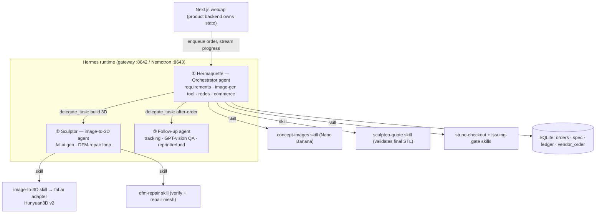

# Hermaquette

From a sentence to a colored 3D figure, with three Hermes agents doing the work.

> Hermaquette orchestrates. Sculptor generates and repairs. Follow-up QAs delivery.
> `delegate_task` fires when `HERMES_GATEWAY_URL` is configured; direct mode runs the same
> skills as a JS pipeline with identical Hermes-attributed events.

**Hermaquette** is a Hermes-operated micro-manufacturing pipeline. You describe a non-electronic object; three Hermes agents research references, generate concept images, build a full-3D colored model, validate and repair it for printability, quote it from a real vendor, take a governed Stripe payment, and manage fulfillment — end-to-end, with a visible DFM fail/fix loop in the Sculptor agent, a colored 3D model rotating in the browser, and a learning memory that improves with each run.

## What's new in V2

- **Three Hermes-attributed skill zones** — Hermaquette (orchestrator) → Sculptor → Follow-up, defined in `hermes/agents/*/AGENT.md`. When `HERMES_GATEWAY_URL` is set, the gateway runs the real agents using native `delegate_task`. Without it, the same skills execute as a JS pipeline in `hermes-worker` with identical Hermes-attributed events.
- **Full 3D colored model** via fal.ai Hunyuan3D v2 — the customer orbits and zooms a PBR-textured GLB in the browser; this is a true 3D figure in the round, not a V1 heightmap relief.
- **Agentic DFM-repair loop** — the Sculptor agent verifies the AI mesh (watertight, wall thickness, size, components) and runs a deterministic repair macro until the part is manufacturable, then makes a bounded accept/reject call. Unrepairable → BLOCKED.
- **PBR textured GLB** — colored interactive viewer with environment lighting; the on-screen figure has realistic material/lighting response.

V1 commerce (Sculpteo VendorQuoteAdapter, Stripe Checkout, Stripe Issuing gate, ledger) is reused unchanged.

## The demo loop (90–110 seconds)

1. **Describe** the Nous Research Girl figure (chunky chibi / designer-toy style)
2. **Hermaquette (orchestrator)** understands the request, calls concept-images skill (Nano Banana), reviews against 3D-friendliness criteria
3. **Concept images** appear — customer selects one
4. **Hermaquette delegates** to the Sculptor agent (`delegate_task`)
5. **Sculptor** calls image-to-3D skill (fal.ai Hunyuan3D v2) — untextured geometry arrives
6. **DFM-repair loop** — Sculptor runs the repair macro → **DFM PASS** (or bounded retries → BLOCKED) ← visible on camera
7. **Nemotron explains** the DFM result in plain English (NVIDIA beat)
8. **Sculptor textures** the same frozen geometry → colored GLB + printable STL returned to orchestrator
9. **Colored 3D model** spins in the browser (orbit / zoom / rotate)
10. **Sculpteo quote** + 10% service fee → customer price shown
11. **Stripe Checkout** (TEST MODE) → payment confirmed server-side
12. **Governed vendor gate**: Stripe Issuing virtual card issued with spend cap (never charged)
13. **Hermaquette delegates** to Follow-up agent (tracking + GPT-vision delivery QA)

## Architecture

```
Customer → Web UI
  → Hermaquette (orchestrator agent)
      → concept-images skill (Nano Banana)
      → delegate_task → Sculptor agent
          → image-to-3d skill (fal.ai Hunyuan3D v2)
          → dfm-repair skill (manifold3d repair loop)
          → returns: colored GLB + printable STL
      → sculpteo-quote → stripe-checkout → issuing-gate skills
      → delegate_task → Follow-up agent (tracking + vision QA)
```



## Sponsor tech coverage

### Nous / Hermes
- **Three Hermes agent definitions** (`hermes/agents/*/AGENT.md`) — Hermaquette orchestrator → Sculptor → Follow-up. Each manufacturing operation is a Hermes **skill** (`SKILL.md` + `scripts/`). **Two execution modes**: gateway mode (`HERMES_GATEWAY_URL` set) runs the real agents with native `delegate_task`; direct mode (default) executes the same skills as a JS pipeline in `hermes-worker` with Hermes-attributed progress events — the event log is identical either way.
- Two `hermes-agent` gateway processes start inside the worker container; `llm.js` (all chat/reasoning) talks only to `http://127.0.0.1:{8642|8643}/v1` — it never holds provider credentials or instantiates direct OpenAI/Nemotron clients. Image generation (`concept-images.js`) uses a direct Nano Banana / DALL-E 3 call since image endpoints don't go through the chat gateway.
- Port 8642: primary gateway (GPT-5.5, reasoning_effort:xhigh, ChatGPT OAuth via `HERMES_AUTH_JSON`); handles all steps except designated NVIDIA ones.
- Port 8643: Nemotron gateway (same `hermes-agent` binary, separate `HERMES_HOME`, NVIDIA API key — `dfm_explanation` and `repair_narration` steps route here).
- Skills: `concept-images`, `image-to-3d`, `dfm-repair`, `sculpteo-quote`, `stripe-checkout`, `issuing-gate`, `tracking-qa` — all defined in `hermes/skills/hermaquette/*/SKILL.md`.
- **DFM self-improvement loop**: each FIXABLE failure appends a runtime `## DFM Lesson —` entry to `hermes/MEMORY.md`; subsequent builds read it and pre-thicken before the DFM gate.
- **Hermes-attributed progress** visible in the UI ("Hermaquette delegated to Sculptor…", "Sculptor: DFM PASS", "Follow-up: delivery QA") — the agent doing each step is named on camera.

### NVIDIA Nemotron
- **Nemotron (`llama-3.1-nemotron-70b-instruct`) explains DFM results in plain English** when the Sculptor agent accepts or rejects a mesh — the unmistakable NVIDIA beat.
- `start.sh` starts a second `hermes gateway` on port 8643 configured with `nvidia/llama-3.1-nemotron-70b-instruct` via `integrate.api.nvidia.com/v1`; the worker routes `dfm_explanation` and `repair_narration` steps to port 8643 — Hermes makes the NVIDIA API call, the worker holds no NVIDIA credentials.
- Geometry decisions remain deterministic; Nemotron handles language only.
- If `NEMOTRON_API_KEY` is absent, port 8643 is not started and those steps fall back to the primary gateway gracefully.

### Stripe
- **Customer leg**: hosted Stripe Checkout (test mode), session created via the Stripe SDK (`stripe.checkout.sessions.create`) with a restricted `rk_test_*` key; confirmed server-side by `sessions.retrieve` (no webhooks, idempotent).
- **Vendor leg**: on human approval, Hermes issues a **test-mode Stripe Issuing virtual card** with `spending_limits` = spend cap and merchant-category scope — the actual agentic-commerce governance primitive. Card is **never charged** (no real Sculpteo purchase).
- Fallback: if Issuing test access is unavailable, the governed approval record is written to SQLite with the same gate semantics.

## Honesty box

| Claim | Reality |
|-------|---------|
| Stripe payments | TEST MODE — use card `4242 4242 4242 4242` |
| Interactive viewer | Full-color PBR textured GLB — orbit/zoom/rotate |
| Printed artifact | Single material color (PA12 SLS) — full-color printing is a V3 feature (deferred) |
| Gross margin | Pre-fees only — Stripe fees and ops costs not deducted |
| Vendor quote | Live Sculpteo API (or recorded fallback labelled as such) |
| Rights | One-off personal gift · Not for resale · No affiliation with Nous/Hermes claimed |
| Issuing card | Issued in test mode, demonstrated but never executed in demo |
| fal.ai spend | Hard $10 budget cap with per-call precheck; DEV_BUDGET separate from demo allowance |

## Quick start

```bash
cp .env.example .env
# Fill in the variables below, then:
docker compose up --build
# Web app: http://localhost:3000
# cad-dfm API: http://localhost:8000/health
# Worker health: http://localhost:3001/health
```

```env
# fal.ai (image-to-3D)
FAL_KEY=your_fal_api_key
FAL_BUDGET_USD=10          # hard cap on fal.ai spend
FAL_DEV_BUDGET_USD=7       # dev budget (reserve rest for demo recording)

# Concept images
NANOBANANA_API_KEY=...      # Nano Banana Pro (primary)
OPENAI_API_KEY=...          # DALL-E 3 fallback

# Vendor + Commerce
SCULPTEO_EMAIL=...
SCULPTEO_PASSWORD=...
STRIPE_SECRET_KEY=sk_test_...
STRIPE_PUBLISHABLE_KEY=pk_test_...

# Hermes agents
HERMES_GATEWAY_URL=http://localhost:8642   # Hermes agent gateway
DEMO_TOKEN=...                             # Auth token for expensive endpoints

# NVIDIA Nemotron (DFM explanation)
NEMOTRON_API_KEY=...       # optional; falls back to primary gateway if absent

# GPT-5.5 via ChatGPT OAuth (best demo quality)
# Without HERMES_AUTH_JSON: start.sh auto-downgrades to gpt-4o (OPENAI_API_KEY path)
HERMES_AUTH_JSON=...
```

For the Cloudflare Tunnel demo URL, see `docs/runbook-coolify-digitalocean.md`.

### Demo dry-run (verify before recording)

```bash
# Full pipeline dry-run (no real payment, no vendor execute)
node scripts/demo/dry_run.js --all

# Cold-run truth-test (HAPPY_PATH=off, cache cleared)
HAPPY_PATH=off node scripts/demo/dry_run.js --all

# Recording mode (pinned known-good params)
HAPPY_PATH=on node scripts/demo/dry_run.js --all
```

## Structure

```
hermaquette/
├── apps/web/                     # Next.js App Router (intake, order page, Stripe, colored viewer)
├── services/hermes-worker/       # Orchestrator dispatch: enqueue orders → Hermes, stream progress
├── services/cad-dfm/             # Python: mesh_repair.py + dfm.py (verify + repair AI mesh)
├── hermes/agents/                # Agent definitions (system prompts + scoped toolsets)
│   ├── hermaquette-orchestrator/AGENT.md
│   ├── sculptor/AGENT.md
│   └── followup/AGENT.md
├── hermes/skills/hermaquette/    # Skills the agents call (SKILL.md + scripts/)
│   ├── concept-images/           #   Nano Banana / DALL-E 3
│   ├── image-to-3d/              #   fal.ai adapter (Hunyuan3D v2)
│   ├── dfm-repair/               #   verify + repair mesh loop
│   ├── sculpteo-quote/           #   vendor quote + printability verdict
│   ├── stripe-checkout/          #   test-mode Stripe Checkout
│   ├── issuing-gate/             #   governed vendor card gate
│   └── tracking-qa/              #   GPT-vision delivery QA
├── hermes/MEMORY.md              # DFM learning store (appended by dfm-repair skill)
├── packages/image3d/             # fal.ai adapter (Hunyuan3D v2 → Meshy fallback) + budget guard
├── packages/vendor/              # VendorQuoteAdapter (Sculpteo live/browser/manual)
├── db/schema.sql                 # SQLite schema (7 tables)
├── docker-compose.yml            # 4 services + 2 volumes
├── scripts/demo/                 # Dry-run harness, cache, happy-path toggle
└── docs/
    ├── runbook-coolify-digitalocean.md
    └── submission.md
```

## Deployment

See `docs/runbook-coolify-digitalocean.md` for the full Coolify + DigitalOcean VPS deployment guide.

---

*Built for the Hermes Hackathon 2026. Deadline: EOD 2026-06-30.*
