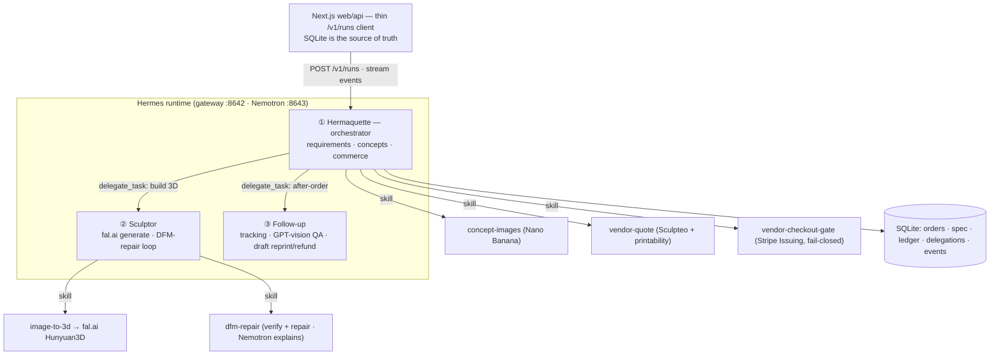

# Hermaquette

From a sentence to a colored, printable 3D figure — with three Hermes agents doing the work.

**Hermaquette** is a Hermes-operated micro-manufacturing pipeline. You describe a non-electronic object; three Hermes agents research it, generate concept images, build a full-3D colored model, validate and repair it for printability, quote it from a real vendor, take a governed Stripe payment, and manage fulfillment — end-to-end, with a visible design-for-manufacture (DFM) fail/fix loop, a colored 3D model rotating in the browser, and a learning memory that improves with each run.

> **Hermes is the brain.** The Hermaquette orchestrator loads its identity from `SOUL.md` and its project playbook from `AGENTS.md`, then delegates to the Sculptor and Follow-up agents via native `delegate_task`. Each manufacturing step is a Hermes skill the agent runs through the terminal tool; SQLite is the single source of truth.

## The three agents

- **① Hermaquette — orchestrator.** Understands the request, runs the concept-image skill, reviews concepts against 3D-friendliness criteria, drives commerce, and delegates the build and after-order work.
- **② Sculptor.** Generates the full-3D colored model (fal.ai Hunyuan3D), runs the deterministic DFM-repair loop until the part is manufacturable, and makes a bounded accept/reject call (unrepairable → BLOCKED).
- **③ Follow-up.** Tracks the order and runs GPT-vision delivery QA, comparing form/shape (not color); drafts any reprint/refund for human approval — never auto-sent.

Children (Sculptor, Follow-up) receive their persona via `delegate_task` context and are context-isolated — the orchestrator's `SOUL.md`/`AGENTS.md` never leak into them.

## How it runs

A three-run lifecycle: the web app is a thin client of the Hermes `/v1/runs` API, and humans gate the two money-touching steps.

1. **Describe** the object → Hermaquette researches it and runs **concept-images** (Nano Banana → DALL·E 3 fallback).
2. Customer **picks a concept** → Hermaquette delegates the build to **Sculptor**.
3. **Sculptor** runs **image-to-3d** (fal.ai → colored GLB + printable STL) then the **dfm-repair** loop → **DFM PASS** (or bounded retries → BLOCKED, visible on camera). **Nemotron** explains the DFM result in plain English (the NVIDIA beat).
4. **vendor-quote** (Sculpteo) + 10% service fee → the **colored 3D model** orbits in the browser and the money card shows the customer price. The run stops here.
5. Customer **pays** (Stripe Checkout, test mode, confirmed server-side) and a human **approves** the vendor spend.
6. **Governed checkout**: a test-mode **Stripe Issuing** virtual card is issued under a spend cap (never charged), then Hermaquette delegates to **Follow-up** for tracking + delivery QA.

## Architecture



Each manufacturing operation is a Hermes skill (`SKILL.md` + `scripts/`). The agent runs `node /hermes/skills/hermaquette/<skill>/scripts/<file>.js <orderId>` via the terminal tool; scripts read their inputs from SQLite (no user text on the command line) and own every state transition.

## Sponsor tech

### Nous / Hermes
- **Three real agents via native `delegate_task`** — Hermaquette → Sculptor → Follow-up, defined in `hermes/agents/*/AGENT.md`. The orchestrator's identity is `SOUL.md`; its playbook is `AGENTS.md` (loaded from `TERMINAL_CWD`); children are context-isolated.
- **Proof of agency**: each delegated child writes its own `delegations` row from inside the child run — the on-screen "Hermaquette → Sculptor → Follow-up" attribution is backed by the database, not a hardcoded string.
- **DFM self-improvement**: each FIXABLE failure appends a `## DFM Lesson` entry to `hermes/MEMORY.md`; later builds read it and pre-thicken before the gate.

### NVIDIA Nemotron
- **Nemotron (`llama-3.1-nemotron-70b-instruct`) explains the DFM result in plain English** when the Sculptor accepts or rejects a mesh. A second `hermes gateway` runs on port `:8643` against `integrate.api.nvidia.com/v1`; the `dfm_explanation` step routes there — Hermes makes the call, the app holds no NVIDIA credentials.
- Geometry decisions stay deterministic; Nemotron handles language only. If `NEMOTRON_API_KEY` is absent, port 8643 isn't started and the step falls back to the primary gateway.

### Stripe
- **Customer leg**: hosted Stripe Checkout (test mode) created via the SDK and confirmed server-side by `sessions.retrieve` (no webhooks, idempotent).
- **Vendor leg**: on human approval, Hermes issues a **test-mode Stripe Issuing virtual card** with `spending_limits` = spend cap and merchant-category scope — the agentic-commerce governance primitive. The card is **never charged**, and the gate fail-closes unless payment is confirmed *and* a human approved *and* the quote is under cap.

## Honesty box

| Claim | Reality |
|-------|---------|
| Stripe payments | TEST MODE — use card `4242 4242 4242 4242` |
| Interactive viewer | Full-color PBR-textured GLB — orbit/zoom/rotate |
| Printed artifact | Single material color (PA12 SLS) — full-color printing not supported |
| Gross margin | Pre-fees only — Stripe fees and ops costs not deducted |
| Vendor quote | Live Sculpteo API (or recorded fallback, labelled as such) |
| Rights | One-off personal gift · not for resale · no affiliation with Nous/Hermes claimed |
| Issuing card | Issued in test mode, demonstrated but never charged |
| fal.ai spend | Hard $10 budget cap with per-call precheck |

## Quick start

```bash
cp .env.example .env     # fill in the keys below
docker compose up --build
# Web app:            http://localhost:3000
# Hermes agent:       http://localhost:8642/health
# cad-dfm API:        http://localhost:8000/health
```

```env
# fal.ai (image-to-3D)
FAL_KEY=your_fal_api_key
FAL_BUDGET_USD=10          # hard cap on fal.ai spend

# Concept images
NANOBANANA_API_KEY=...     # Nano Banana Pro (primary)
OPENAI_API_KEY=...         # DALL·E 3 fallback

# Vendor + commerce
SCULPTEO_API_KEY=...
STRIPE_SECRET_KEY=sk_test_...
STRIPE_PUBLISHABLE_KEY=pk_test_...

# NVIDIA Nemotron (DFM explanation — optional)
NEMOTRON_API_KEY=...

# GPT-5.5 via ChatGPT OAuth (best demo quality)
# Without HERMES_AUTH_JSON, start.sh auto-downgrades to gpt-4o (OPENAI_API_KEY path)
HERMES_AUTH_JSON=...
HERMES_API_KEY=...         # gates the /v1/runs API
```

## Structure

```
hermaquette/
├── apps/web/                     # Next.js App Router (intake, order page, Stripe, colored viewer)
├── services/hermes-agent/        # Hermes gateway container (start.sh + Dockerfile)
├── services/cad-dfm/             # Python: mesh_repair.py + dfm.py (verify + repair AI mesh)
├── hermes/SOUL.md                # Orchestrator identity (copied to ~/.hermes/SOUL.md)
├── hermes/AGENTS.md              # Orchestrator playbook (skills, paths, delegation templates)
├── hermes/agents/                # Agent definition docs (orchestrator · sculptor · followup)
├── hermes/skills/hermaquette/    # Skills the agents run (SKILL.md + scripts/)
│   ├── concept-images/  image-to-3d/  dfm-repair/
│   └── vendor-quote/  vendor-checkout-gate/  tracking-qa/
├── hermes/MEMORY.md              # DFM learning store (appended by dfm-repair)
├── packages/image3d/             # fal.ai adapter (Hunyuan3D → Meshy fallback) + budget guard
├── packages/vendor/              # Sculpteo VendorQuoteAdapter (live / browser / manual)
├── db/schema.sql                 # SQLite schema
├── docker-compose.yml            # web · hermes-agent · cad-dfm
└── docs/runbook-coolify-digitalocean.md
```

## Deployment

See [`docs/runbook-coolify-digitalocean.md`](./docs/runbook-coolify-digitalocean.md) for the full Coolify + DigitalOcean VPS guide.

> **Note:** `hermes-runtime/` is a git submodule. Clone with `git clone --recurse-submodules` (or run `git submodule update --init` after cloning), or the Hermes runtime build fails.

## License

This project's own code is released under the [MIT License](./LICENSE) © 2026 Chushul Suri.

`hermes-runtime/` is a git submodule referencing [NousResearch/hermes-agent](https://github.com/NousResearch/hermes-agent) and remains under its own upstream license — it is not relicensed here.

---

*Built for the Hermes Hackathon 2026.*
